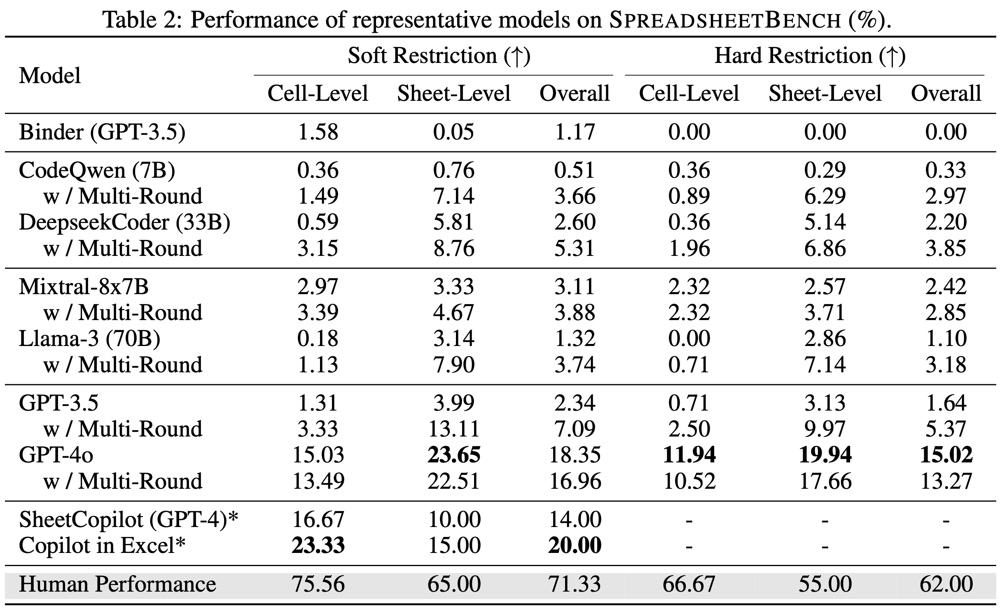

# SpreadsheetBench: Towards Challenging Real World Spreadsheet Manipulation

[Homepage](https://spreadsheetbench.github.io/) · [Paper](https://arxiv.org/abs/2406.14991) · [Data](https://github.com/RUCKBReasoning/SpreadsheetBench/tree/main/data)


SpreadsheetBench is a challenging spreadsheet manipulation benchmark that (1) contains 912 questions exclusively derived from real-world scenarios, (2) includes spreadsheet files with tabular data in various formats, (3) features a more reliable evaluation metric akin to online judge platforms.

## News

[2024/07] 🔥 Our paper was published on [arxiv](https://arxiv.org/abs/2406.14991).

[2024/06] 📦 We released the code for model inference and evaluation.

[2024/06] 📊 We released the sample data of SpreadsheetBench.

## Overview

We introduce SpreadsheetBench, a challenging spreadsheet manipulation benchmark exclusively derived from real-world scenarios, designed to immerse current large language models (LLMs) in the actual workflow of spreadsheet users. Unlike existing benchmarks that rely on synthesized queries and simplified spreadsheet files, SpreadsheetBench is built from 912 real questions gathered from online Excel forums, which reflect the intricate needs of users. The associated spreadsheets from the forums contain a variety of tabular data such as multiple tables, non-standard relational tables, and abundant non-textual elements. Furthermore, we propose a more reliable evaluation metric akin to online judge platforms, where multiple spreadsheet files are created as test cases for each instruction, ensuring the evaluation of robust solutions capable of handling spreadsheets with varying values. Our comprehensive evaluation of various LLMs under both single-round and multi-round inference settings reveals a substantial gap between the state-of-the-art (SOTA) models and human performance, highlighting the benchmark's difficulty.

## Data Statistics and Comparison

SpreadsheetBench comprising 912 instructions and 2,729 test cases, with an average of three test cases per instruction. The instructions in our benchmark cover a broad spectrum of spreadsheet manipulation types, including find, extract, sum, highlight, remove, modify, count, delete, calculate, and display. The spreadsheet files in our benchmark contain tabular data with various row size, column size, number of table and table formats.


Table 1 compares SpreadsheetBench to other spreadsheet manipulation benchmarks. Our questions are sourced exclusively from real-world data and exhibits a higher average word count per instruction. Our spreadsheet files contain multiple sheets with non-standard relational tables and multiple tables within a single sheet. Real-world questions often involve additional explanations within the spreadsheet, a characteristic not present in previous benchmarks. Furthermore, we employ OJ-style evaluation metrics with three test cases per instruction.


## Experiments

We evaluate LLMs under two distinct settings: 1. Single Round: In this mode, we present the model with the initial few rows of spreadsheet files within the prompt, allowing for only one inference. 2. Multi-Round: Building on the single-round prompt setting, we incorporate additional prompt that utilizes the ReAct technique and code execution feedback to enhance the accuracy of code solutions produced by LLMs over multi-round conversation.



The results shown in Table 2 indicate that current LLMs and spreadsheet agents are inadequate in managing complex spreadsheet manipulation tasks as required by real-world scenarios. There is a substantial gap between existing LLMs or products and human performance produced by Excel experts, emphasizing the critical need for advancement in LLMs tailored for spreadsheet manipulation.

## Dataset Introduction

The sample data are located in ``data/sample_data_200.tar.gz``, containing two hundred data points in JSONL formats.
Each data point includes the following five attributes:
- ``id``: The unique id of the data point.
- ``instruction``: The question about spreadsheet manipulation.
- ``spreadsheet_path``: The folder path that stores the test cases.
- ``instruction_type``: The type of the question (i.e., Cell-Level Manipulation or Sheet-Level Manipulation).
- ``answer_position``: The cell position where the answer needs to be filled in.

The ```spreadsheet``` folder contains the corresponding spreadsheet files of the data points. There are two hundred folders in the ```spreadsheet``` folder named as unique ids. In each folder, there are multiple test cases named ```{No.}_{id}_input.xlsx``` and ```{No.}_{id}_answer.xlsx```, represent the input file and answer file, respectively.

## Environment Setup

The environment is used for model inference and evaluation and you can install the requirements with pip:
```
pip install -r requirements.txt
```

The inference process can be performed on **Linux**, **Windows**, and **MacOS**.
During this process, LLMs generate the code solution for each question, and the code solution is further executed to produce the result spreadsheet files.

The evaluation process (after model inference) can only be performed on **Windows** environment, as we need to use the ```win32com``` library, which only exists in Windows.
This library is used to open all spreadsheet files generated by LLMs because some cell values are only visible when the spreadsheet file is opened manually.
We will also investigate whether the evaluation toolkit can be used on Linux systems and look for alternatives to this spreadsheet opening procedure.

## Inference

### Code Execution Environment

First, you need to configure the code execution environment. We use a Docker container to execute the Python code generated by LLMs.
```
cd code_exec_docker
docker build -t xingyaoww/codeact-execute-api -f Dockerfile.api .
docker build -t xingyaoww/codeact-executor -f Dockerfile.executor .
```

If you have problem installing pip packages inside the docker container, try add ```--network=host``` when running ```docker build```, or other possible [solutions](https://stackoverflow.com/questions/28668180/cant-install-pip-packages-inside-a-docker-container-with-ubuntu).

Then, you need to set up a port and deploy the container.
```
bash start_jupyter_server.sh PORT
```

Now, the code execution environment is ready.

### Model Deployment

Then, you need to deploy your model.
For OpenAI models, you can directly inference with the following settings.
For open-source models, you can use the OpenAI compatible server provided by [vLLM](https://docs.vllm.ai/en/stable/serving/openai_compatible_server.html).

### Single-round Setting

Get the inference result in single-round setting:
```
cd inference
bash scripts/inference_single.sh
```

You need to modify the model, api_key, and base_url parameters in inference_single.sh.

### Multi-round Setting

Get the inference result in multi-round setting (Execution Feedback + 5 Rows):
```
bash scripts/inference_multiple_row_exec.sh
```

Get the inference result in multi-round setting (ReAct + Execution Feedback):
```
bash scripts/inference_multiple_react_exec.sh
```

Get the inference result in multi-round setting (ReAct + Execution Feedback + 5 Rows):
```
bash scripts/inference_multiple_row_react_exec.sh
```

You need to modify the model, api_key, and base_url parameters in the scripts.
The code solution are saved in the ```inference/output``` folder and the result spreadsheet files are saved in the ```data/sample_data_200/outputs``` folder.

## Evaluation

The evaluation toolkit can only be used on **Windows** environment.
Using the following script to get the evaluation result:
```
cd evaluation
bash scripts/evaluation.sh
```

You need to modify the setting (single, multi_react_exec, multi_row_exec, or multi_row_react_exec) and model parameters in evaluation.sh.

## Acknowledge

We thanks the [code-act](https://github.com/xingyaoww/code-act) team for providing the code execution environment.

## Lisence and Citation

The project is hosted with the [CC BY SA 4.0](https://creativecommons.org/licenses/by-sa/4.0/) License.

```
@article{ma2024spreadsheetbench,
  title={SpreadsheetBench: Towards Challenging Real World Spreadsheet Manipulation},
  author={Ma, Zeyao and Zhang, Bohan and Zhang, Jing and Yu, Jifan and Zhang, Xiaokang and Zhang, Xiaohan and Luo, Sijia and Wang, Xi and Tang, Jie},
  journal={arXiv preprint arXiv:2406.14991},
  year={2024}
}
```
