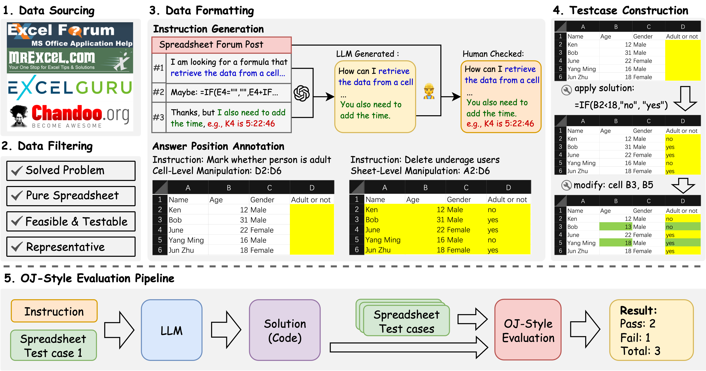
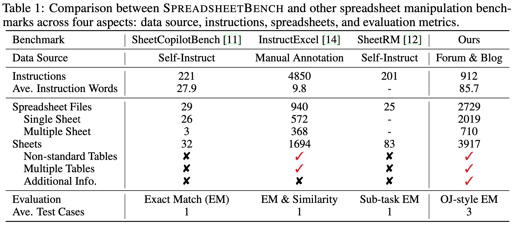

# SpreadsheetBench: Towards Challenging Real World Spreadsheet Manipulation

[Homepage](https://spreadsheetbench.github.io/) · Paper · Data

SpreadsheetBench is a challenging spreadsheet manipulation benchmark that (1) contains 912 questions exclusively derived from real-world scenarios, (2) includes spreadsheet files with tabular data in various formats, (3) features a more reliable evaluation metric akin to online judge platforms.

## News

[2024/06] 🔥 We released the sample data of SpreadsheetBench.

## Overview

We introduce SpreadsheetBench, a challenging spreadsheet manipulation benchmark exclusively derived from real-world scenarios, designed to immerse current large language models (LLMs) in the actual workflow of spreadsheet users. Unlike existing benchmarks that rely on synthesized queries and simplified spreadsheet files, SpreadsheetBench is built from 912 real questions gathered from online Excel forums, which reflect the intricate needs of users. The associated spreadsheets from the forums contain a variety of tabular data such as multiple tables, non-standard relational tables, and abundant non-textual elements. Furthermore, we propose a more reliable evaluation metric akin to online judge platforms, where multiple spreadsheet files are created as test cases for each instruction, ensuring the evaluation of robust solutions capable of handling spreadsheets with varying values. Our comprehensive evaluation of various LLMs under both single-round and multi-round inference settings reveals a substantial gap between the state-of-the-art (SOTA) models and human performance, highlighting the benchmark's difficulty.

## Data Statistics and Comparison

SpreadsheetBench comprising 912 instructions and 2,729 test cases, with an average of three test cases per instruction. The instructions in our benchmark cover a broad spectrum of spreadsheet manipulation types, including find, extract, sum, highlight, remove, modify, count, delete, calculate, and display. The spreadsheet files in our benchmark contain tabular data with various row size, column size, number of table and table formats.

Table 1 compares SpreadsheetBench to other spreadsheet manipulation benchmarks. Our questions are sourced exclusively from real-world data and exhibits a higher average word count per instruction. Our spreadsheet files contain multiple sheets with non-standard relational tables and multiple tables within a single sheet. Real-world questions often involve additional explanations within the spreadsheet, a characteristic not present in previous benchmarks. Furthermore, we employ OJ-style evaluation metrics with three test cases per instruction.

## Dataset Introduction

The sample data are located in ``data/sample_data_200.tar.gz``, containing two hundred data points in JSONL formats.
Each data point includes the following five attributes:
- ``id``: The unique id of the data point.
- ``instruction``: The question about spreadsheet manipulation.
- ``spreadsheet_path``: The folder path that stores the test cases.
- ``instruction_type``: The type of the question (i.e., Cell-Level Manipulation or Sheet-Level Manipulation).
- ``answer_position``: The cell position where the answer needs to be filled in.

## Acknowledge

We thanks the [code-act](https://github.com/xingyaoww/code-act) team for providing the code execution environment.

## Lisence

The project is hosted with the [CC BY SA 4.0](https://creativecommons.org/licenses/by-sa/4.0/) License.
